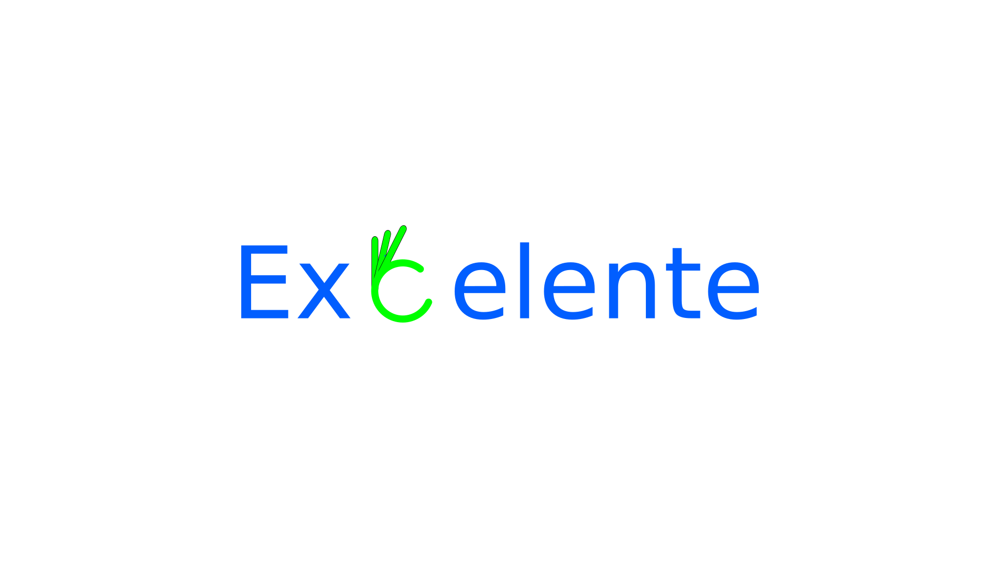

# Excelente the excellent tools to build UI

excelente is open-source UI tools kit for building performance focused UI with ease of use in mind, excelente contains:

- [_Excelente components_](#) is a UI components library which is our main and first product
- [_Excelente Icons_ (coming in near future )](#) is a Icons library which have a wide range of icons